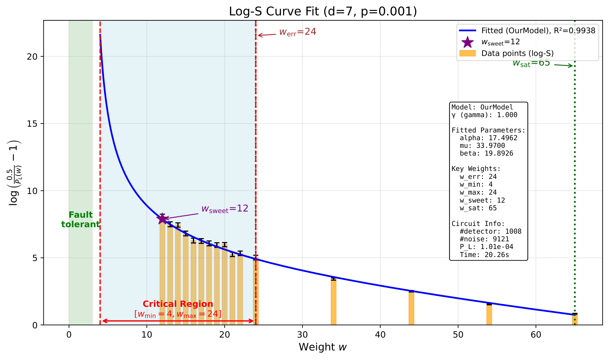
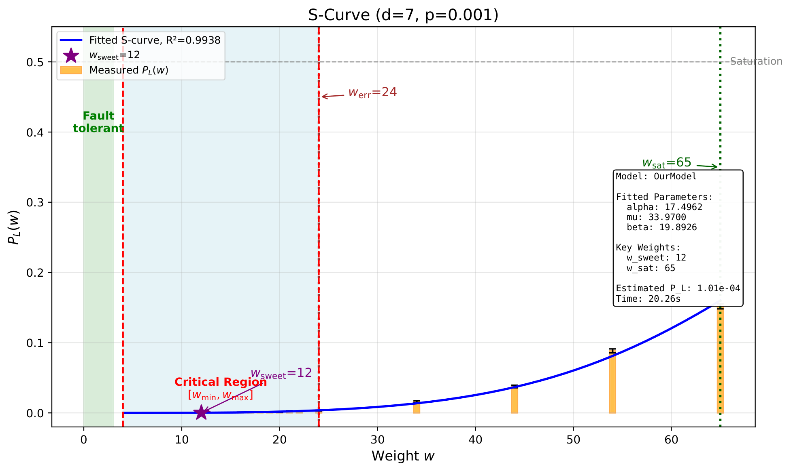

# ScaLERQEC
---

<p align="center">
  
</p>
<p align="center">
  <em>Figure 1: Our logo.</em>
</p>

ScaLERQEC is a scalable framework for estimating logical error rates (LER) of quantum error-correcting (QEC) circuits at scale.
It combines an optimized C++ backend (QEPG with SIMD acceleration and OpenMP parallelism) with high-level Python interfaces for QEC experimentation, benchmarking, symbolic analysis, and Monte Carlo fault injection.

ScaLERQEC is compatible with [Stim](https://github.com/quantumlib/Stim) circuits, but uses a completely different approach -- **stratified fault sampling with S-curve fitting** -- to estimate logical error rates orders of magnitude faster than brute-force Monte Carlo.

## Citation
---

If you use ScaLERQEC in your research, please cite our paper:

```bibtex
@misc{ye2026scalabletestingquantumerror,
      title={Scalable testing of quantum error correction},
      author={John Zhuoyang Ye and Jens Palsberg},
      year={2026},
      eprint={2602.04921},
      archivePrefix={arXiv},
      primaryClass={quant-ph},
      url={https://arxiv.org/abs/2602.04921},
}
```

## Documentation
---

We use Sphinx to automatically generate the documents:

```bash
python -m sphinx.cmd.build -b html docs/source docs
```

You may visit the current documentation through the following link:

**Documentation website:**
https://yezhuoyang.github.io/ScaLERQEC/


## Installation
---

### Option 1 -- Install via pip (recommended)

```bash
pip install scalerqec
```

This installs:

* The Python package `scalerqec`
* The compiled C++ QEPG backend (`scalerqec.qepg`) with SIMD and OpenMP support
* All Python modules for LER calculation, sampling, symbolic analysis, etc.

You can then immediately import all modules in Python:

```python
import scalerqec
import scalerqec.qepg
```

### Option 2 -- Install from source

1. Clone the repository:

```bash
git clone https://github.com/yezhuoyang/ScaLERQEC.git
cd ScaLERQEC
```

2. Build and install:

```bash
pip install -e .
```

This compiles the C++ backend using pybind11 and installs the package in development mode.

### Prerequisites

**All platforms:**
- Python >= 3.10
- A C++20-compatible compiler

**No external C++ libraries required.** The C++ backend is self-contained -- Boost has been removed. All dependencies (pybind11, stim, pymatching, etc.) are handled automatically by pip.

**Platform-specific notes:**

| Platform | Compiler | OpenMP |
|----------|----------|--------|
| **Windows** | MSVC (Visual Studio Build Tools) | Built-in (`/openmp:llvm`) |
| **macOS** | Xcode command-line tools | `brew install libomp` |
| **Linux** | GCC or Clang | Built-in (`-fopenmp`) |


## Project Structure
---

```
scalerqec/
├── qepg                # C++ QEPG backend with SIMD acceleration (via pybind11)
├── Clifford/           # Clifford circuit representation, STIM parser, Python QEPG
├── Monte/              # Monte Carlo LER estimation (standard + LDPC codes)
├── QEC/                # High-level QEC circuit construction from stabilizers
├── Stratified/         # ScaLER: stratified sampling with S-curve fitting
├── Symbolic/           # Exact symbolic LER computation (ground truth)
└── util/               # Binomial utilities, Pauli helpers, output formatting
```

**Bundled Stim circuits** (under `stimprograms/`):

| Code family | Distances available |
|-------------|-------------------|
| Surface code | d = 3, 5, 7, 9, 11, 13, 15, 17, 19, 21, 23, 25, 27, 30 |
| Repetition code | d = 3, 5, 7, ..., 29 |
| Color code | d = 3, 5, 7, 9, 11, 13, 15 |
| Toric code | d = 3, 5, 7, 9, 11, 13, 15, 17 |
| Hexagonal code | d = 3, 5, 7, ..., 25 |
| BB LDPC codes | [[72,12,6]], [[90,8,10]], [[108,8,8]], [[144,12,12]], [[288,16,18]] |


## Quick Start
---

### 1. Construct a QEC circuit from stabilizers

A detailed tutorial is available in `Tutorial.ipynb`. Below is a smaller example using the [[3, 1, 3]] Z-repetition code.

```python
from scalerqec.QEC.qeccircuit import StabCode
from scalerqec.QEC.noisemodel import NoiseModel

qeccirc = StabCode(n=3, k=1, d=3)

# Stabilizer generators
qeccirc.add_stab("ZZI")
qeccirc.add_stab("IZZ")

# Set the logical Z operator
qeccirc.set_logical_Z(0, "ZZZ")

# Configure noise and measurement scheme
noise_model = NoiseModel(0.001)
qeccirc.scheme = "Standard"   # Also supports: Shor, Knill, Flag
qeccirc.rounds = 2

# Build the circuit
qeccirc.construct_circuit()
```

You can inspect the intermediate representation:

```python
qeccirc.show_IR()
```

Output:
```
c0 = Prop[r=0, s=0] ZZI
c1 = Prop[r=0, s=1] IZZ
c2 = Prop[r=1, s=0] ZZI
d0 = Parity c0 c2
c3 = Prop[r=1, s=1] IZZ
d1 = Parity c1 c3
c4 = Prop ZZZ
o0 = Parity c4
```


### 2. ScaLER -- Time-budgeted S-curve LER estimation (main method)

ScaLERQEC estimates the LER by stratified fault sampling and S-curve fitting. The `Scaler` class runs a three-phase adaptive algorithm within a wall-clock time budget:

1. **Phase 1 (Initialization):** Binary search for error-onset and saturation weights, fit an initial S-curve.
2. **Phase 2 (Sweet-spot exploration):** Uniformly sample weights near the theoretical sweet spot.
3. **Phase 3 (Adaptive refinement):** Iteratively add samples at weights needing more logical error events.

<p align="center">
  
</p>
<p align="center">
  <em>Figure 2: Diagram for the main method in ScaLERQEC.</em>
</p>

**From a Stim circuit file (recommended):**

```python
from scalerqec.Stratified import Scaler, ModelType

scaler = Scaler(
    error_rate=0.001,
    time_budget=120,               # wall-clock seconds
    model_type=ModelType.OUR_MODEL,
    gamma=1,
    num_subspaces_phase2=12,
)

ler = scaler.calculate_LER_from_file(
    filepath="stimprograms/surface/surface7",
    pvalue=0.001,
    codedistance=7,
    figname="Figures/Surface7_ScaLER",
    titlename="Surface Code d=7",
)

print(f"LER: {ler:.6e}")
print(f"R²: {scaler._R_square_score:.4f}")
print(f"Sweet spot: {scaler._sweet_spot}")
print(f"Total samples: {sum(scaler._subspace_sample_used.values()):,}")
```

Output:
|  |  |
|:---------------------------------------------------------------------:|:----------------------------------------------------------------------------:|
| *Figure 3: Subspace error rate in log-logit space* | *Figure 4: Fitted S-curve in probability space* |


### 3. ScaLER for LDPC codes

For LDPC codes (e.g., BB codes), use `ScalerLDPC` which integrates a belief-propagation + OSD decoder:

```python
from scalerqec.Stratified.ScalerLDPC import ScalerLDPC

calculator = ScalerLDPC(
    error_rate=0.001,
    time_budget=60,          # seconds
    max_bp_iters=20,
    osd_order=0,
)
calculator.calculate_LER_from_file(
    filepath="stimprograms/ldpc/bbcode_72_12_6_rounds18",
    pvalue=0.001,
    codedistance=6,
    figname="BBCode",
    titlename="BB Code [[72,12,6]]",
)
```


### 4. Monte Carlo LER estimation

Standard Monte Carlo fault injection with adaptive batching:

**From a StabCode object:**

```python
from scalerqec.Monte import MonteLERcalc

mc = MonteLERcalc(time_budget=30, samplebudget=500000, MIN_NUM_LE_EVENT=50)
mc.calculate_LER_from_StabCode(qeccirc, noise_model)
print(f"LER = {mc._estimated_LER:.2e} +/- {mc._uncertainty:.2e}")
```

**From a Stim circuit file (uniform noise):**

```python
mc = MonteLERcalc(time_budget=30, samplebudget=500000)
ler = mc.calculate_LER_from_file(
    samplebudget=500000,
    filepath="stimprograms/surface/surface7",
    pvalue=0.001,
)
print(f"LER = {ler:.2e}")
```

**From a Stim circuit string (non-uniform noise):**

ScaLERQEC supports circuits with mixed noise types (DEPOLARIZE1 at varying rates, X_ERROR, Y_ERROR, Z_ERROR, DEPOLARIZE2):

```python
mc = MonteLERcalc(time_budget=30, samplebudget=500000)
stim_str = open("my_noisy_circuit.stim").read()
ler = mc.calculate_LER_from_stim_circuit(stim_str)
print(f"LER = {ler:.2e}")
```

**Monte Carlo for LDPC codes:**

```python
from scalerqec.Monte import MonteLDPC

mc_ldpc = MonteLDPC(time_budget=60, samplebudget=100000, max_bp_iters=20)
ler = mc_ldpc.calculate_LER_from_file(
    samplebudget=100000,
    filepath="stimprograms/ldpc/bbcode_72_12_6_rounds18",
    pvalue=0.001,
)
```


### 5. Symbolic LER analysis (exact ground truth)

ScaLERQEC can compute the **exact symbolic polynomial** representation of the logical error rate:

```python
from scalerqec.Symbolic import SymbolicLERcalc

sym = SymbolicLERcalc()
exact_ler = sym.calculate_LER_from_StabCode(qeccirc, noise_model)
print(f"Exact LER = {exact_ler:.6e}")

# Or from a Stim file
exact_ler = sym.calculate_LER_from_file(
    filepath="stimprograms/surface/surface3",
    pvalue=0.001,
)
```

This is useful for validating Monte Carlo and ScaLER estimates on small circuits.


### 6. Using the C++ QEPG backend directly

The QEPG (Quantum Error Propagation Graph) is a binary model of how errors propagate to flip detector outcomes.

<p align="center">
  
</p>
<p align="center">
  <em>Figure 5: Illustration of how we compile a QEPG graph in ScaLERQEC.</em>
</p>

```python
import scalerqec.qepg as qepg

# Compile a Stim circuit into a reusable QEPG graph
stim_str = open("stimprograms/surface/surface7").read()
graph = qepg.compile_QEPG(stim_str)

# Sample at fixed error weight (stratified sampling)
det_outcomes, obs_outcomes = qepg.return_samples_many_weights_separate_obs_with_QEPG(
    graph,
    weight=[3, 5, 7],
    shots=[10000, 10000, 10000],
)

# Monte Carlo sampling at a given error rate
det, obs = qepg.return_samples_Monte_separate_obs_with_QEPG(
    graph, error_rate=0.001, shot=100000
)

# Non-uniform noise sampling (per-source probabilities)
import numpy as np
from scalerqec.Monte.noise_model_parser import extract_noise_model

noise_model = extract_noise_model(stim_str)
det, obs = qepg.return_samples_nonuniform_to_numpy(
    graph,
    noise_model.noise_probs,
    np.array([p.source_a for p in noise_model.correlated_pairs], dtype=np.int64),
    np.array([p.source_b for p in noise_model.correlated_pairs], dtype=np.int64),
    np.array([p.prob for p in noise_model.correlated_pairs], dtype=np.float64),
    shot=100000,
)
```


# LogiQ -- A high-level, fault-tolerant quantum programming language
---

We introduce LogiQ -- which supports users to define their own logical QEC block and implement logical Clifford+T operations.

```python
# 1) Define a family of surface codes (sugar -> CSSCode core)
code surface(d: Int) as CellComplex over Z2 {

  cells {
    faces     F[x,y]  in 0..(d-2), 0..(d-2);
    edges_x   Ex[x,y] in 0..(d-2), 0..(d-1);
    edges_y   Ey[x,y] in 0..(d-1), 0..(d-2);
    vertices  V[x,y]  in 0..(d-1), 0..(d-1);
  }

  boundary {
    d2(F[x,y]) =
      Ex[x,y]   +
      Ey[x+1,y] +
      Ex[x,y+1] +
      Ey[x,y];

    d1(Ex[x,y]) = V[x,y]   + V[x+1,y];
    d1(Ey[x,y]) = V[x,y]   + V[x,y+1];
  }

  css {
    hx = matrix(d2);
    hz = transpose(matrix(d1));
  }
}

code five_qubit as StabilizerCode {

  # Number of physical qubits (optional if implied by generator length)
  n = 5;

  generators {
    S0 = "XZZXI";
    S1 = "IXZZX";
    S2 = "XIXZZ";
    S3 = "ZXIXZ";
  }

  logical_z {
    LZ0 = "ZZZZZ";
  }
}


surface q1 [n=40, k=1, d=5]   # First surface-code block (distance-5)
surface q2 [n=40, k=1, d=5]   # Second surface-code block (distance-5)
surface t0 [n=84, k=1, d=7]   # Magic-T ancilla block (distance-7)

q1[0] = LogicH q1[0]

t0 = Distill15to1_T[d=25]     # returns a magic_T handle (see MagicQ below)
InjectT q1[0], t0

q2[1] = LogicCNOT q1[0], q2[1]

c1 = LogicMeasure q1[0]
c2 = LogicMeasure q2[1]
```

# MagicQ -- A high level fault-tolerant quantum programming for dynamic protocol with Post-selection
---

We introduce MagicQ -- which allows the user to construct a magic state factory. MagicQ also has the full power to express all code-switching protocols.

```python
protocol Distill15to1_T(surface f, int d):
  Repeat:

      # ---- X-type stabilizer checks ----
      c_x1 = LogicProp IIIIIIIXXXXXXXX
      c_x2 = LogicProp IIIXXXXIIIIXXXX
      c_x3 = LogicProp IXXIIXXIIXXIIXX
      c_x4 = LogicProp XIXIXIXIXIXIXIX

      # ---- Z-type stabilizer checks ----
      c_z1  = LogicProp IIIIIIIIZZZZZZZZ
      c_z2  = LogicProp IIIZZZZIIIIZZZZ
      c_z3  = LogicProp IZZIIZZIIZZIIZZ
      c_z4  = LogicProp ZIZIZIZIZIZIZIZ
      c_z12 = LogicProp IIIIIIIIIIZZZZ
      c_z13 = LogicProp IIIIIIIIZZIIIZZ
      c_z14 = LogicProp IIIIIIIIZIZIZIZ
      c_z23 = LogicProp IIIIIZZIIIIIIZZ
      c_z24 = LogicProp IIIIZIZIIIIIZIZ
      c_z34 = LogicProp IIZIIIZIIIZIIIZ

      Success = c_x1 == 0 && c_x2 == 0 && c_x3 == 0 && c_x4 == 0 &&
                c_z1 == 0 && c_z2 == 0 && c_z3 == 0 && c_z4 == 0 &&
                c_z12 == 0 && c_z13 == 0 && c_z14 == 0 &&
                c_z23 == 0 && c_z24 == 0 && c_z34 == 0
      Until Success

      return
```

## How ScaLER works
---

**Main method**

ScaLERQEC estimates the LER by stratified fault-sampling and curve fitting:

We propose a novel method which tests the logical error rate by stratified sampling and curve fitting. See the tutorial for a detailed explanation. With a fixed QEC circuit and the noise model, we provide a simple interface for this method.


## Roadmap
---

### Completed

- [x] Support installation via `pip install`
- [x] Higher-level, easier interface to generate QEC programs
- [x] Add cross-platform installation support (Windows, macOS, Linux)
- [x] Python interface to construct QEC circuits from stabilizers
- [x] Write full documentation (Sphinx)
- [x] Support LDPC codes and LDPC code decoders (ScalerLDPC with BP+OSD)
- [x] Remove Boost dependency -- use custom DynamicBitset with SIMD acceleration
- [x] SIMD support (AVX2/SSE2/NEON) with cache-line aligned FlatBitTable
- [x] Non-uniform noise model support (DEPOLARIZE1/2, X/Y/Z_ERROR, PAULI_CHANNEL_1/2)
- [x] OpenMP parallel sampling across threads
- [x] CI/CD pipeline with GitHub Actions (lint, build, test on Linux/macOS/Windows)
- [x] Support toric codes, color codes, and BB LDPC codes

### In Progress

- [ ] **CUDA backend support**
  - [ ] Port `FlatBitTable::xor_row_into` to CUDA kernel for GPU-accelerated GF(2) matmul
  - [ ] Implement GPU-side Poisson+CDF sparse sampler
  - [ ] Benchmark against Stim's SIMD sampler on large circuits (d >= 21)

- [ ] **Enum-based gate dispatch for C++ backend**
  - [ ] Replace `Gate::name` (std::string) with `enum class GateKind` in clifford.hpp
  - [ ] Convert string comparisons in `backward_graph_construction()` to switch statement
  - [ ] Expected 5-10x speedup on the backward traversal hot loop

- [ ] **Refactor adaptive batching in monteLER.py**
  - [ ] Extract the 5x copy-pasted adaptive loop into `_adaptive_monte_carlo(sample_fn, decode_fn)`
  - [ ] Reduces ~400 lines of duplication across `calculate_LER_from_*` methods

### Planned

- [ ] **Magic state distillation / cultivation**
  - [ ] Implement 15-to-1 and 20-to-4 distillation protocols as Stim circuits
  - [ ] ScaLER estimation of magic state factory output error rate
  - [ ] Support post-selection in LER estimation

- [ ] **Qiskit compatibility**
  - [ ] Convert Qiskit `QuantumCircuit` to ScaLER `StabCode` or Stim circuit
  - [ ] Import noise models from Qiskit `NoiseModel` objects

- [ ] **Advanced noise models**
  - [ ] Decoherence noise (T1/T2 relaxation as Pauli channels)
  - [ ] Spatially correlated noise (crosstalk between neighboring qubits)
  - [ ] Leakage errors and leakage reduction units

- [ ] **Lattice surgery and code switching**
  - [ ] Support split/merge operations between surface code patches
  - [ ] LDPC code switching protocols
  - [ ] Estimate LER of multi-patch logical operations

- [ ] **HotSpot analysis**
  - [ ] Identify which noise sources contribute most to logical failures
  - [ ] Classify errors by type (hook error, gate error, propagated error)
  - [ ] Visualize error flow through the QEPG graph

- [ ] **Visualization**
  - [ ] Interactive QEPG graph visualization (networkx or D3.js)
  - [ ] Stim circuit diagram rendering

- [ ] **Dynamic circuits**
  - [ ] Support mid-circuit measurement and classical feedback
  - [ ] Compatible with IBM dynamic circuit model

- [ ] **Static analysis pass**
  - [ ] Detect symmetries in the circuit structure
  - [ ] Exploit symmetry to reduce sampling cost

- [ ] **Pauli-measurement-based fault tolerance**
  - [ ] Support circuits using Pauli measurements instead of CNOT+measure
  - [ ] Compile Pauli-based schemes to QEPG


## Development Notes (for contributors)
---

### Building from source

```bash
git clone https://github.com/yezhuoyang/ScaLERQEC.git
cd ScaLERQEC
pip install -e .
```

This compiles the C++ QEPG backend via pybind11. No external C++ libraries are needed -- the build system handles everything automatically.

### Running tests

```bash
# Full test suite
pytest tests/ -v

# Quick smoke test
python -c "import scalerqec; import scalerqec.qepg; print('OK')"
```

### Code formatting

We use [ruff](https://docs.astral.sh/ruff/) for Python formatting:

```bash
pip install ruff
ruff format src/scalerqec/
ruff check src/scalerqec/
```

### Rebuilding the C++ backend

After modifying C++ source files under `QEPG/src/`:

```bash
pip install -e . --no-build-isolation
```
